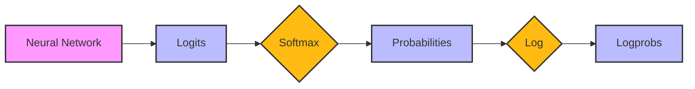
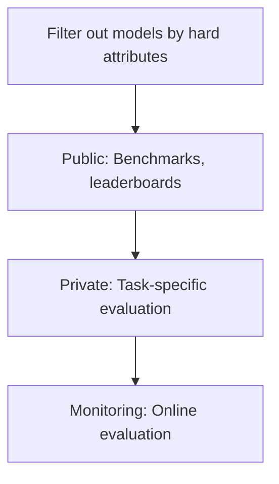

# 1. Introduction to Language Models

## Tokens
Tokens != Words
`"Unbelievable"` => `["Un", "Believ", "Able"]`  
`"Hello, World!"` => `['Hello', ',', 'world', '!'`  

Note: there are fewer unique tokens than unique words

## Types of Language Models
**Masked Language Models:** trained to predict missing tokens anywhere in a sequence, *using context from before and after the missing token*. 
- E.g., BERT
- More commonly used for **non-generative** tasks, e.g., sentiment analysis and text classification

**Autoregressive Language Models:** trained to predict next token in a sequence, *using only the preceding tokens*. 
- E.g., GPT
- Better for **generative** tasks 

## Self-Supervision
The dramatic success behind language models lies in self-supervision. 

## Types of Use Cases

| Dichotomy                 | Details                                                                                                                                                                                       |
| ------------------------- | --------------------------------------------------------------------------------------------------------------------------------------------------------------------------------------------- |
| **Critical vs Complementary** | The more critical it is, the more important accuracy is                                                                                                                                       |
| **Reactive vs Proactive**     | Reactive must be fast, while proactive can be precomputed and shown opportunistically                                                                                                         |
| **Dynamic vs Static**         | Dynamic AI features might mean that each user has their own model, continually finetuned on their data. Static might have one model for each group of users which is not continually updated. |

Features can also have humans-in-the-loop at varying levels. Crawl-Walk-Run: 
- Crawl: human involvement is mandatory
- Walk: AI can directly interact with internal employees
- Run: AI can have direct interactions with external users

## Setting Expectations
Decide on metrics, e.g.: 
- Quality metrics
- Latency metrics
- Cost metrics
- Interpretability, fairness

## Differences in Training
- **Pre-training**: training a model from scratch on text completion. 
- **Fine-tuning**: continuing to train a previously trained model. 
- **Post-training**: conceptually the same as fine-tuning and might be used interchangeably. However, post-training is usually done by model developers, e.g., OpenAI to make a model better at following instructions before release. Fine-tuning is usually done by application developers to adapt it to specific needs. 

# 2. Understanding Foundation Models

## Training and Compute Considerations
- **FLOPs:** Floating Point Operations. Metric to capture how many operations it takes to, e.g., train a model. Compute required for a given task. 
- **FLOP/s:** Floating Point Operations per second: how many floating point operations per second you can run at a machine's peak performance. Usually machines are utilized *below* their peak performance (50-70% of the peak) so the actual speed will be lower. 
- Time to train model:
$$
\text{Time to Train (\# seconds)} = \frac{\text{Dataset Size (\# FLOPs)}}{\text{Total FLOP/s across all GPU's}}
$$
- **Compute-optimal:** a model that can achieve the best possible performance given a fixed compute budget. For compute-optimal training, you typically need # training tokens to be ~ 20x model size. 
## Post-Training

Post-training in general has the following 2 steps:
1. **Supervised Finetuning (SFT):** Finetune the pre-trained model on high-quality instruction data to optimize for conversations rather than completion
2. **Preference Finetuning:** Further finetune to output responses that align with human preference. Typically done with **reinforcement learning**, e.g. RLHF or RLAIF or DPO. 

Analogy: pre-training is like reading to acquire knowledge, while post-training is like learning how to use that knowledge. 

## Sampling

- **Greedy sampling:** pick token with the highest probability. 
	- This results in boring outputs for language models
	- Instead, we can sample over tokens in proportion to their probabilities. 
- **Temperature:** to redistribute the probabilities of possible values, we can sample with a *temperature* parameter. 
	- Higher temperature => increased probabilities of rarer tokens
	- Temperature is a constant used to adjust logits before the softmax transformation: 
	  $$ x'_i = \frac{x_i}{T} $$ where $x_i$ is the logit for token $i$ and $x'_i$ is the adjusted logit. 
	- If logits = $[1,2]$ then the unadjusted softmax = $[0.27, 0.73]$ but if $T = 2$ then the adjusted softmax = $[0.38, 0.62]$ thereby increasing the likelihood that the lower prob class is picked.
	- **Picking a temperature > 1 increases rare probabilities while picking a temperature < 1 decreases them** 
- Many model providers actually return logprobs (log probabilities) so that you can try your own sampling strategy

- **Top-K sampling:** to reduce computational overhead, we pick the top-k logits and perform softmax over only those
- **Top-p sampling:** sort probabilities in descending order, find cumulative sum, and stop when you hit cumulative sum >= $p$. 
- **Stopping Condition:** it is useful to prevent model from generating overly long output sequences. We can use the EOS token to enforce **early stopping**. 

### Test-Time Compute
Rather than token-level sampling, what if we sampled the whole output? We generate multiple responses and pick the one that works the best. 

Rather than pure random sampling, we can do **beam search** to generate a fixed number of most promising candidates at each step of sequence generation. For a given beam width $B$, at each step we generate the next $B$ tokens for each potential next token. Then we prune the ones with the lowest probability, move to the next token, and repeat. This is kind of like doing a $B$-step lookahead on top of greedy search. 

One key here is to increase not just the quantity but the diversity of outputs at test-time. A more diverse set of options is more likely to yield better candidates. To select the best output, you can either ask the user to select or select the one with the highest probability. 

This is particularly useful if a model is not robust, i.e., its outputs change dramatically with small changes in the inputs (think about Random Forests!). 

### Structured Outputs
JSON, SQL, etc. 

- **Prompting:** first course of action. Can combine with AI-as-a-judge to validate. 
- **Post-processing:** find common mistakes and correct them, e.g., add missing bracket 
- **Constrained sampling:** filter logit vector to keep only tokens that meet certain constraints, then sample from those. Hard to generalize since it is grammar-specific (e.g., JSON, YAML). 
- **Fine-tuning:** more reliable than prompting. 
	- Note that OpenAI and Google both have APIs for finetuning their models with your data

## Probabilistic Nature of AI
- **Inconsistent:** model generates very different responses for the same or slightly different prompts
	- Can fix the *seed* variable along with temperature, top-k, etc. 
- **Hallucination:** model gives response not grounded in the facts
	- What causes hallucincations?
		- Self-delusion: a model makes an incorrect assumption and snowballs from there
		- Mismatched internal knowledge: during supervised finetuning, if the labelers don't incorporate all their knowledge, there is no way for the model to know what is made up or not. 

# 3. Evaluation Methodology

**Perplexity, Entropy, Cross-Entropy**
More complex vocabularies need more entropy to encode them
Higher perplexity = more uncertainty

**Objective Evaluation**
Structured outputs

**Subjective Evaluation**
Need reference answers
Can do comparative evaluation (head-to-head)

**AI-as-a-Judge** 
Can use smaller, more specialized model
Can use more expensive model

# 4. Evaluating AI Systems

**Evaluation-Driven Development**: define evaluation criteria before building. 

## Domain-Specific Capability
We can use a) the inclusion of domain-specific data in training and b) domain-specific benchmarks. 

Typically measured using exact evaluation, primarily with Multiple Choice Questions (MCQ's). But these are good tests of *knowledge* and *reasoning* rather than *generation* (summarization, translation, etc.). 

## Generation Capability
Common NL metrics for generation include *fluency* and *coherence*. In addition, different tasks might also have their own metrics:
- Translation tasks consider *faithfulness*, or how faithful is the translation to the original. 
- Summarization tasks consider *relevance*

For many tasks, *factual consistency* is very important. We can use AI-as-a-judge, but with specialized scoring models. We can use provided knowledge from context to judge *textual entailment*. Factual consistency is especially important for RAG systems. 

## Instruction-Following Capability
Examples:
- Generating structured outputs correctly
- Following format instructions in the prompt

Can be conflated with domain-specific or generation capabilities. 

Roleplaying capability can fall into this category. 

## Cost and Latency
Usually trading off cost against latency and scale in Pareto optimization. 
- **Cost:** cost per output token
- **Latency:** time to first token (p90), time per total query (p90)
- **Scale:** tokens per minute or TPM

Other considerations:
- **Overall model quality:** Elo score in chatbot arena
- **Factual consistency** 
- **Generation capability**

## Model Selection
- **Hard attributes:** model attributes you can't change, e.g., latency for model API
- **Soft attributes:** attributes you can change, e.g., accuracy, factual consistency. 

Evaluation Workflow:

### Model API vs Self-Hosting
Self-hosting requires "open-source" model

Note that open source models have licensing considerations. 
- Does license allow commercial use?
- If so, are there any restrictions? 
- Does the license allow using the model's outputs to train/improve other models? E.g., model distillation. 

## Design Your Evaluation Pipeline
### 1. Evaluate All Components in your System
E.g., break down an application that extracts current employer from a resume PDF into 2 steps:
1. Extract all text from PDF
2. Extract current employer from extracted text

Separate *turn-based* evaluation from *task-based* evaluation

### 2. Create an Evaluation Guideline
Define evaluation criteria
- Correct response != Good response
- Think deeply about what makes a good response
- Develop criteria based on application and user experience, e.g., relevance, factual consistency, safety

Create scoring rubrics with examples
- Scoring system: binary, 1-5, 0-1
- Create rubric with examples
Tie evaluation metrics to business metrics
- Factual consistency  of 80% => automate 30% of customer support requests
- Usefulness threshold, e.g., >50% factual accuracy for anything useful
- Business metrics, e..,g stickiness, engagement

### 3. Define Evaluation Methods and Data
- Evaluation methods depend on the criteria. E.g., toxicity classifier for toxicity detection, semantic similarity for relevance, AI judge for factual consistency. 
- Can use logprobs to measure model's confidence about generated tokens and for classification tasks. 
- Human evaluation is the north-star metric. 
- Think about how to collect eval data in production
- Can generate multiple eval sets based on different data slices, e.g., paid vs free, traffic sources, etc. 
- How much data is enough? We can use bootstrap to test variability. 
- Evaluate your evaluation pipeline!
	- Do better responses get higher scores?
	- How reliable is the pipeline? If you run the same pipeline twice, do you get different results?
	- How correlated are your metrics? If they're perfectly correlated, ditch one. If not at all correlated, it's possible one metric isn't trustworthy. 

