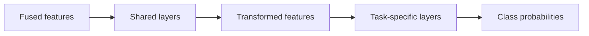

Integrity enforcement on social media is split into two categories:
1. Harmful content: posts that contain violence, nudity, self-harm, hate speech, etc. 
2. Bad actors: Fake accounts, spam, phishing, organized unethical activities, other unsafe behaviors

# Clarifying Questions
- What types of media do we want to monitor? Images, text, videos?
- What specific categories of harmful content do we want to identify? 
- Do we have human moderators/annotators available? 
	- If not, do we have user reports? 
- What is the required latency?
	- Suggest: real-time for most urgent categories like violence; near-real time or hourly for others. 

# Framing the Problem as an ML Task
Given that we are running on multiple modalities (image, text), we can use **fusing methods** to combine the data. 
## Late Fusion
ML models process each modality independently, then combine predictions to make a final output. 
Pros:
- Can train, evaluate, deploy each model independently
Cons:
- Need to collect labels and train each model separately for each modality, lots of added overhead
- Combination of modalities might be more informative than each one individually

## Early Fusion
Pros:
- More informative
- Only need to collect training data for one task
Cons:
- Harder learning task 

## Classification Task
* Single binary classifier
	* We don't know which harmful category a post belongs to 
	* Hard to find which categories are underperforming
* One classifier per harmful class 
	* Training separate models is expensive and complicated
* Multi-label (multiclass) classifier
	* Simpler
	* Using same featureset for all models may not be ideal
	* Labels are mutually exclusive
* Multi-task classifier
	* There are two stages: shared layers and task-specific layers
	* The task-specific layers have one "head" per task. 

# Data Preparation
- User data: demographics, location
- Posts data: IP, timestamp, text, image, links
- User-post interactions: likes comments, saves, teimstamp

# Feature Engineering
## Textual Content
- Convert text into embeddings with BERT or SBERT. 

## Image and Video
- Preprocessing: decode, resize, normalization.
- Embedding: CLIP for images, VideoMoCo for videos 

## Social Features
- Number of comments, likes, shares
- Scaled and normalized
- Comments: can embed comments 

## Author Features
- Violation History
- Demographics, location
- Age
- Number of followers and following
- Device features: device type, app version, VPN usage

# Labels
- Hand labeling: slow but accurate
- Natural labeling: fast but noisy

Can use **hand labeling for offline evaluation (accuracy) and natural labeling for training (scale)**. 
# Model Development
Normal neural network training: 
- Binary cross-entropy loss for each task 
- Regularization to prevent overfitting

## Offline Evaluation
PR, AUROC

## Online Evaluation
* Prevalence: target metric
	- #(posts)
	- #(views)
- Valid appeals: control metric
- A-B tests

# Serving
User uploads posts to application, which calls the Harmful Content Detection Service

## Harmful Content Detection Service 
This service calls:
- Feature Preparation
- Trained ML model from registry

## Punishments
We have a number of possible punishments depending on confidence from model:
- High confidence: remove post from server
- Medium confidence: demote post from feed