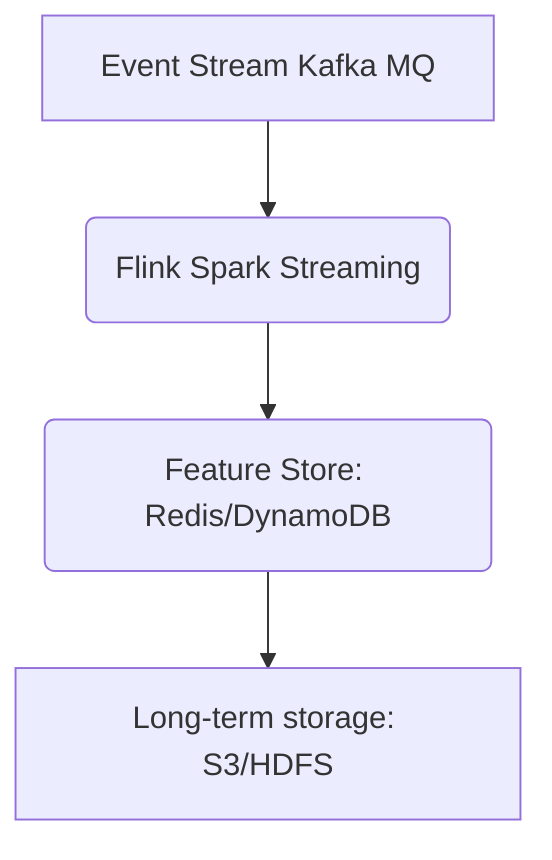
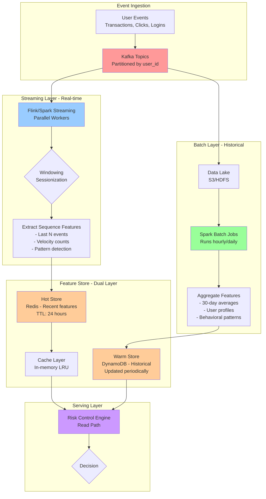

# What are the components of a Real-time Model? 

## Batch
- Precomputed features, e.g., user history, previous events, slowly changing dimensions
- Feature engineering for precomputed features
- Model training/evaluation (unless you're doing continual learning!)

## Online
- Inference!
- Real-time features, e.g., login location, datetime, IP, device type
	- Can use Apache Flink for real-time processing
- Recent sequence features
- Continual learning (maybe?)

# How to handle high QPS events?

## Horizontal Scaling
- Use stateless services which are easy to scale. 
- Auto-scale based on CPU/QPS metrics
- K8s for orchestration

## Cache
- Use Redis 
- Cache predictions for common user-feature values to speed up identical requests

## Request Batching
- If allowed by latency
- Batch requests and then run inference asynchronously

# How to process Real-Time Data?

We take a **two-layer approach:**

## Layer 1: Streaming (Real-Time)
- Recent events get processed synchronously (as they arrive) 
- Update feature store immediately

## Layer 2: Batch (Offline) 
- Runs periodically (hourly or daily) 
- Computes user-level aggregations
- We write batch data periodically to the feature store (Redis or DynamoDB) to update the user-level data. 

Example from [Airbnb](https://medium.com/airbnb-engineering/building-a-user-signals-platform-at-airbnb-b236078ec82b): 

## Read-Write Load Balancing

How do we balance read and write loads? 

**Write path** = "how data gets into the system". 
- E.g., user makes txn => event logged => Kafka => preprocessing => feature store. 
- Happens when new data arrives
- Can be a bit slower (within reason): this doesn't directly impact user experience
- Like the loading dock at a warehouse
- **Write-heavy**

**Read path** = "how data gets out of the system"
- E.g., Risk Engine needs user features => Looks up in cache => Query database => Return features
- Happens when data is needed for a decision
- Has to be fast - user is waiting on decision! 
- Like the shipping dock at a warehouse - we need to quickly find items
- **Read-heavy**

For typical ML use cases:
**Write path:** heavy load. 
- Millions of events per second. 
- Goes to Kafka => Flink/Spark => Feature store (in batches)
- High capacity but high latency is OK 
**Read path:** lighter. 
- Reads from separate replicas or caches (**don't touch the *write* database**)
- Cache frequently accessed data

## Offline vs Online Metrics

- Offline metrics are used during model training and validation. **They are based on our (potentially noisy) labels and might not be the actual thing we are optimizing for**
	- Precision, Recall, F1-Score, AUROC
	- Ranking loss (recommendation)
	- Log loss
- Online metrics are **the actual user behavior** **which we are optimizing for**, e.g., click-through rate, watch time, conversion rate
	- Measured via A-B tests