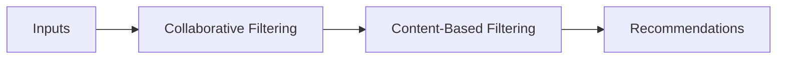

# Links
- https://developers.google.com/machine-learning/recommendation/dnn/training 
- https://medium.com/data-science/recommender-systems-a-complete-guide-to-machine-learning-models-96d3f94ea748 
- https://towardsdatascience.com/recommender-systems-a-complete-guide-to-machine-learning-models-96d3f94ea748/

# Similarity Measures
- Cosine similarity
- Dot product
	- Equal to cosine similarity if the vectors are normalized (unit-length)
- Euclidean distance
	- 1:1 with cosine similarity if the vectors are normalized

More popular items may have larger norms (because they get more gradient updates and move farther from the origin during training) and this will influence the dot product similarity, for better or worse.

# Content-Based Filtering

Uses *similarity between items* to recommend items similar to what the user has liked. 
* Each row in the item matrix represents an item's features
* Each row in the user matrix represents a user's features
* We compare each item row to the given user's row and find items with the highest similarity to the user using a measure like the dot product to denote similarity

- Pros: 
	- Doesn't need data from other users
	- Can capture user-specific interests
- Con:
	- Cold-start problem if new user 
	- Feature representation requires hand-engineering: you need to create features like "genre" or "length" or "director". 
		- This only works well in scenarios where you have well-defined and informative user- and item- metadata. 
	- **Can't recommend *new* interests for user since it only works off prior interests:** if a given user has only seen sci-fi movies, you can only recommend to them sci-fi movies!

## Example
Note that this approach requires some way to translate each movie into genres (e.g., "Notebook => 0.9 Drama")

Item matrix:

| Movie        | Action | Romance | Sci-Fi | Drama | Comedy |
| ------------ | ------ | ------- | ------ | ----- | ------ |
| Titanic      | 0      | 1.0     | 0      | 0.8   | 0      |
| Inception    | 0.7    | 0       | 1.0    | 0.3   | 0      |
| Avengers     | 1.0    | 0       | 0.5    | 0     | 0.4    |
| The Notebook | 0      | 1.0     | 0      | 0.9   | 0      |
| Interstellar | 0.3    | 0       | 1.0    | 0.5   | 0      |

User matrix: (Alice liked Titanic and The Notebook while Bob liked Inception and Avengers)

| User  | Action | Romance | Sci-Fi | Drama | Comedy |
| ----- | ------ | ------- | ------ | ----- | ------ |
| Alice | 0      | 1.0     | 0      | 0.85  | 0      |
| Bob   | 0.85   | 0       | 0.75   | 0.15  | 0.2    |

Then taking the **dot product** of each user and item, we would get low ratings for Alice on Inception while Bob would get high ratings on Interstellar. 

We could also use **KNN** or **ANN** to find items that are similar to a given user. 

# Collaborative Filtering
Uses *similarities between users* to recommend items. If user A is similar to user B and user B liked item 1, we recommend item 1 to user A. 

Pros:
- Features can be hand-engineered or learned embeddings
- The system can discover users' new areas of interest
- Unlike Content Filtering, no domain knowledge is needed to hand-engineer item features

Cons:
- Cold-start problem: system can't make accurate recommendations for new users
- Doesn't handle users with niche interests well: might be difficult to find similar users

## User-Item Matrix
Aka the **Feedback Matrix**: 
- Each row $i$ represents user $i$ 
- Each column $j$ represents item $j$
- Each value $U_{i,j}$ is the rating user $i$ gave item $j$ 
	- The values can be *explicit* (e.g. user ratings) or *implicit* (e.g. watch time, engagement)

$$U_{ij} = \text{Rating from user } i \text{ for item }j$$
Note that this matrix will likely be very sparse as most users do not interact with most items! 

## User-User (user-based) Collaborative Filtering

In the example above, Alice and Bob both like Movie A and so we infer a) Alice would give Movie C ~2 stars b) Bob would give Movie B ~3 stars

Note that this is **user-based** collaborative filtering, but there is also **item-item** collaborative filtering. 

## Item-Item (item-based) Collaborative filtering
Using the same example, Movies A and C seem negatively correlated, therefore we predict that Alice would give Movie C a low rating. 

## Summary of CF vs Content Based Filtering

# Hybrid filtering
**Hybrid filtering approaches** solve the cold-start problem by leveraging a combination of hand-engineered item and user features (Content Filtering) and Collaborative Filtering. 
- This particularly makes sense since Collaborative and Content Filtering have complementary strengths and weaknesses
- Light FM is a popular hybrid algorithm that uses matrix factorization
- There are two types: **parallel** and **sequential** hybrid filtering. Sequential is more popular. 

# Matrix Factorization
Matrix factorization is useful for several reasons:
- Dimensionality reduction: the user-item matrix $A$ is huge and sparse, so compression makes computations faster and storage easier
	- Scalability: instead of searching through huge, sparse matrices, we're just multiplying vectors together
- Latent factors: the factorization model can discover certain "latent factors" like "action intensity" or "emotional depth" 
- Handling sparsity: matrix factorization can "fill in the blanks" for unrated items based on learned user and item representations

## Structure
Given a feedback matrix which is $A \in \mathbb{R}^{mxn}$ , $m$ = number of users, $n$ = number of items, a matrix factorization learns:

- $U \in \mathbb{R}^{mxd}$ : user embedding matrix, row $i$ is the embedding for user $i$ 
- $V \in \mathbb{R}^{nxd}$ : item embedding matrix, row $j$ is the embedding for item $j$ 

Then the product $U V^T$ is an approximation of $A$. 
- $U$ and $V$ are more compact representations than $A$: $A$ has $O(mn)$ entries while $U, V$ have $O(d(m+n))$ entries. This is very helpful when $d << n$ or $d << m$. 
- $U$ and $V$ therefore learn latent structure in the data, similar to PCA
- Note that the prediction for a specific pair item $i$ and user $j$ basically boils down to the dot product of $U_i, V_j$. 
- Note that $UV^T_{ij}$ is the **dot (inner) product** of $U_i, V_j$ which is the dot products of the embeddings for user $i$ and item $j$. So it's similar conceptually to content-based filtering from above, but instead of hand-engineering the features **we are learning them**. 
- The **outer product** of $U_i, V_j$ is a matrix where entry $i,j$ tells you how well user attribute $i$ aligns with item attribute . 

## Loss Function
Our loss function is the squared error between $A$ and $UV^T$: 

$$\min_{U,V} \sum_{(i,j)} (A_{ij} - \langle U_i, V_j \rangle)^2$$
In practice, we add a regularization term to help prevent overfitting and increase generalization: 

$$
\min_{U,V} \sum_{(i,j)} (A_{ij} - \langle U_i, V_j \rangle)^2 + \lambda (||U_i\|^2_2 + ||V_j||^2_2)
$$

## Optimization 
- In theory, we could solve this via SVD, but in practice since $A$ is very sparse this isn't a great approach. 
- In practice, we use SGD or Weighted Alternating Least Squares (WALS) to minimize the loss function. Note that **the loss function is non-convex.** 
	- In WALS, we fix one matrix ($U$) and optimize the other ($V$). Then you switch and repeat until convergence. 

However, there's a major problem here. If we only use the observed $(i,j)$ pairs, then the model can spit out any random or bad values for *unobserved* pairs $(i,j)$ without affecting the loss function. For example, matrices $U_{ij}, V_{ij} = 1 \: \forall i,j$ would have zero loss on the training data. This will make the model overfit and generalize poorly. There are several approaches to address this:
1. Label all unobserved entries as negative: $A_{ij} \in {0,1} \: \forall i,j$. 
	- Since $A$ is usually very sparse, this would lead to unobserved entries dominating observed entries during training, again leading to poor generalization. 
2. Label the unobserved entries as some tunable value $w_0$ 
	- $\sum\limits_{i,j \in \text{obs}} (A_{ij} - \langle U_i, V_j \rangle)^2 + w_0 \sum\limits_{i,j \notin \text{obs}} (A_{ij} - \langle U_i, V_j \rangle)^2$ 
	- We can use held-out data to tune the value of $w_0$. 
3. Add regularization to keep predictions reasonable and help generalization.

## Pros and Cons
Pros: 
- Rather than needing domain knowledge, we learn embeddings
- Rather than only relying on user's prior interests, we can show them items, increasing the diversity of recommendations
Cons:
- Cold-start problem for items
	- Can be approximated with heuristics (e.g., average of embeddings from same creator)
	- We can show items to small number of random users to get interaction data
- Cold-start problem for user
	- Can ask user for interests on registration
- Hard to include "side features", e.g., age, country, language. 
	- **This is a major drawback which we will address in the next section!** 

# Deep Neural Networks
Say we treat the problem as a multiclass classification prediction problem where the *input is the user query* and the *output is a probability vector with dimension = number of items*. Then the model output becomes the probability vector that a given user interacts with each of our items. 

- Input features can include dense features (watch time, time since last watch) and sparse features (watch history, country). 
	- We can also include "side features", e.g., country, age. 
- Let $\psi(x) \in \mathbb{R}^d$ be the output of the last hidden layer. 
- Then the model maps: $\psi(x) \rightarrow \hat{p} = h(\psi(x)V^T)$ where:
	- $\hat{p}$ is the probability vector
	- $h$ is the softmax function
	- $V \in \mathbb{R}^{nxd}$ is the matrix of weights of the softmax layer, which maps from scores to probabilities. $V$ is (sort of) our item embedding matrix now.   
	- $\psi(x) \in \mathbb{R}^d$ is the output of the last hidden layer: this is the "embedding" of our user query $x$. 
	- $V_j \in \mathbb{R}^d$ is the vector of weights connecting the last hidden layer to the output for item $j$. This is the "embedding" of item $j$. 
	- The final prediction *is still a dot product*, but instead of $\langle U_i, V_j \rangle$ it's $\langle \psi(x), V_j \rangle$ 
	- We use cross-entropy loss with SGD to learn the model weights. 

Pro over traditional matrix factorization: 
- Traditional matrix factorization uses item-based user features, e.g. "user $i$ watched item $j$"
- Deep factorization can decouple user features from specific items, e.g., user age, gender, behavioral patterns, preferences, context 
Con:
- We're not incorporating *item features* only *user features*

## Two-Tower Neural Network
To solve this, we use a **two-tower neural network**: 
- One neural network maps user query features to query embedding: $x \rightarrow \psi(x) \in \mathbb{R}^d$ 
- One neural network maps item features to item embedding: $j \rightarrow \phi(j) \in \mathbb{R}^d$ 
- Then we take the dot product of $\langle \psi(x), \phi(j) \rangle$ as our output. 
	- Note that this isn't strictly a probability anymore, but a score. 
This approach lets us incorporate any arbitrary *user and item features*, not just item- or user-features or user-item interactions. 
- One version is **pure collaborative filtering** version where we use user features in the user tower but only user-item interactions in the item tower. This version will be faster but won't incorporate video features like language or duration. 
- If we combine user- and item-features along with user-video interaction data, this is a **hybrid  two-tower neural network**. 

## Folding
One common problem with deep factorization is **folding**: 
- If the model is only shown positive examples, the embeddings from different items/queries may end up in the same region, leading to spurious recommendations. E.g., items with different languages might end up together. 
- To address this, we can use **negative sampling** during training: we show the model negative samples to push them farther apart
	- We can also filter out such cases during candidate generation to avoid this during inference
- We can go one step further with **contrastive learning:** we select (positive, negative) pairs to show the model during training such that it learns embeddings which push apart positive and negative labels. 
	- Negative labels might be videos the user disliked or randomly chosen dissimilar videos

# Factorization Machines

The above linear matrix factorization only models **2-way interactions:** between users and items. 

> "User_5" rated "Movie_10" 4.5

What if we wanted to model more complex interactions? 

> "User_5" rated "Movie_10" 4.5 and Genre=Action and Day=Weekend

The naive way to learn these weights would require exponential time! You'd need to learn:

> User x Movie, User x Time, User x Day, Movie x Time,  Movie x Day, ...

However, we can learn these weights in linear time. Any pairwise interaction can be computed as a dot product. 

> Interaction(User, Movie) = ⟨embedding_user, embedding_movie⟩
> Interaction(Time, Device) = ⟨embedding_Time, embedding_Device⟩

There is an algebra trick that lets us skip having to do all these pairwise interactions (which would be $\mathcal{O}(n^2)$) :

$$\sum_{i,j}{\langle e_i, e_j \rangle} = \text{sum of all embeddings}^2  - \frac{\text{sum of (embeddings squared)}}{2}$$

Factorization machines are **linear** not **deep**. But you can make it deep by feeding FM embeddings into a neural network. 

# Common system design pattern

1. Retrieval: generate smaller subset from population of items. Fast and scalable but not precise (high recall, low precision)
2. Scoring: use precise model to score candidates
3. Re-ranking: Rank by score but also apply filters, e.g., user explicitly dislike or boost newer items. 

## Metrics
1. **Precision@k**: proportion of relevant videos among top **k** recommendations 
2. **mAP:** mean over the average precision 
3. **Diversity:** how dissimilar recommended videos are to each other. To measure this, we calculate the average pairwise similarity between videos in the list. 

## Retrieval (Candidate Generation)
- Candidate generation prioritizes speed and recall over accuracy
- Can use embeddings from Collaborative Filtering or Two Tower model and run Nearest Neighbors to find closest items
	- We might choose here a **pure** (not **hybrid**) two-tower model
- For large-scale retrieval, KNN can be too slow
	- If the embeddings are known statically, we can precompute list of top candidates for each query offline. Works well for related-item recommendations.
	- Use **Approximate Nearest Neighbor (ANN)** algorithms like **Hierarchical Navigable Small Worlds (HNSW)** 
- In practice, it is common to use multiple candidate generation systems for different aspects of users' interests, e.g., popularity, trending, reelvant to location. 

## Scoring
* Need to think very carefully about objective function for scoring:
- Maximizing Click Rate:
	- The system may recommend click-bait videos
- Maximize Watch Time:
	- The system may recommend very long videos
- Increase diversity and maximize *session* watch time 
- Scoring can be done with any models which generate probabilities or scores
	- Logistic regression trained against, e.g., click event
	- Factorization Machines
	- DeepFM or neural networks
	- GBDT's 
	- Two-tower neural networks with more features (i.e., **hybrid**) 

## Re-Ranking
Re-rank candidates according to score plus additional criteria, along with some filters:
- Diversity
- Applying other ML models to filter out out clickbait, harmful content
- Video freshness
- Duplicate videos

## Explore vs Exploit
One thing to consider in the design is how much you "exploit" probabilities and patterns versus trying to "explore" new patterns.

Some possible approaches for exploration: 
- Introduce randomization into recommendations (with low probability)
- Optimize for item diversity alongside item score

