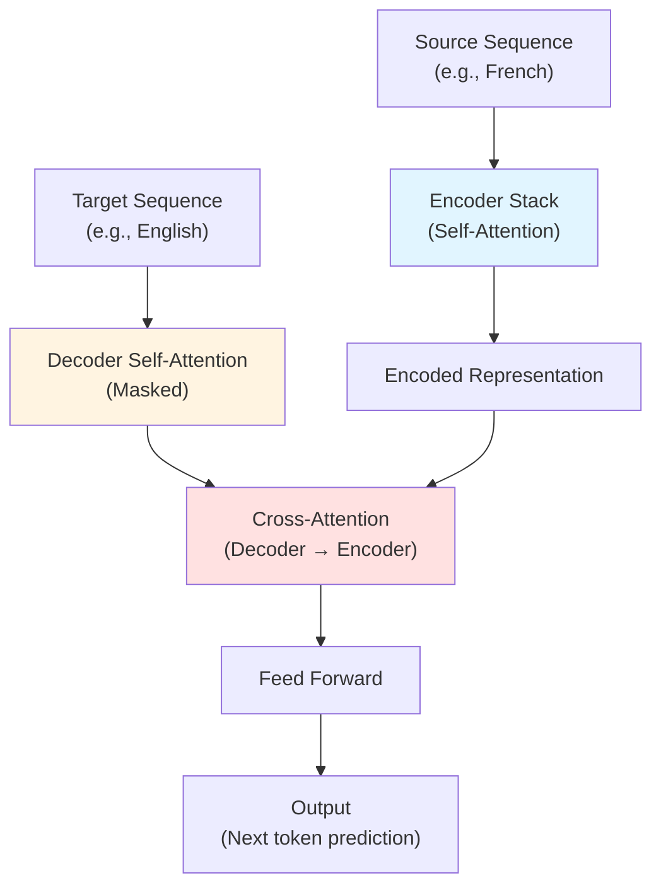
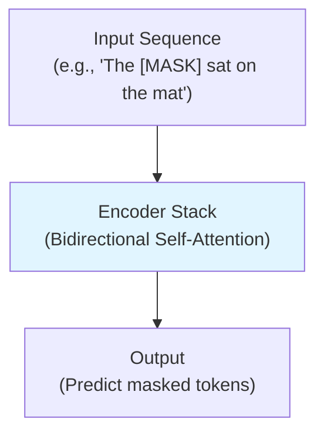
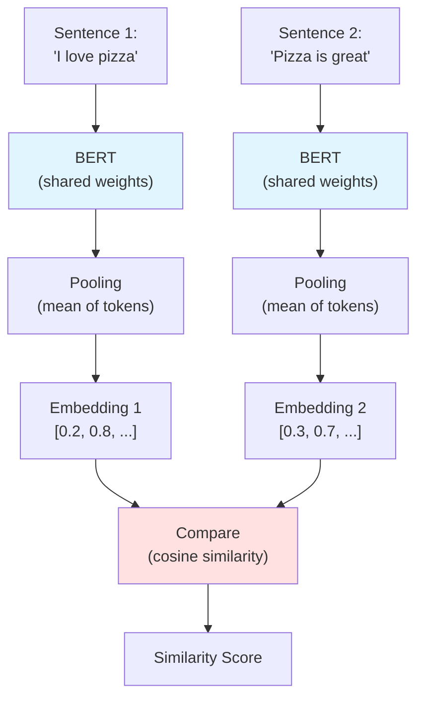

# Links

## CS 224N Notes
- [Seq2seq with attention](https://web.stanford.edu/class/cs224n/readings/cs224n-2019-notes06-NMT_seq2seq_attention.pdf) 
- [Self-attention and transformers](https://web.stanford.edu/class/cs224n/readings/cs224n-self-attention-transformers-2023_draft.pdf) 
- [Pretraining and BERT](https://web.stanford.edu/class/cs224n/slides_w25/cs224n-2025-lecture09-pretraining.pdf) 

## Blog Posts
- [Google AI blog post with visualizations](https://ai.googleblog.com/2017/08/transformer-novel-neural-network.html)
- [Visualizing seq2seq with attention](https://jalammar.github.io/visualizing-neural-machine-translation-mechanics-of-seq2seq-models-with-attention/) 
- [Illustrated transformers](https://jalammar.github.io/illustrated-transformer/)
- [Transformer paper annotated with PyTorch code](https://nlp.seas.harvard.edu/2018/04/03/attention.html)


# Seq2Seq Models
Seq2Seq models take in one sequence of input and generate another sequence as output. At 

We do the following at each time step of the input:
- Generate new hidden state and pass into following `encoder` call

Then for each time step of the output:
- Generate output word from `decoder`


```
# Encoder
hidden_state = init()
for input_token in input:
	hidden_state = encoder(hidden_state, input_token)

# Context vector is final hidden state from encoder
context = hidden_state

# Decoder
decoder_hidden = context 
outputs = []
prev_token = START_TOKEN

while prev_token != END_TOKEN:
	output_token, decoder_hidden = decoder(decoder_hidden, prev_token)
	outputs.append(output_token)
	prev_token = output_token
```


**Major drawback:** the context vector here becomes a "bottleneck" that must encode the entire meaning of the input sequence! This becomes a huge problem for very long sequences. 


# Attention
There are two major changes from a classic seq2seq model:
1. The encoder passes *all* hidden states to the decoder: 
2. At each time step, the decoder does a few extra steps before producing output:
	1. Looks at all the encoder hidden states it received (each hidden state is associated with a certain input word)
	2. Gives each hidden state a score and softmaxes the scores
	3. Multiply each hidden state by its softmaxed score

Let's formalize this: 

So the context vector $c_i$ at time step $i$ is the weighted sum of the hidden states from the input. 

The score for hidden state $h_j$ from input word $j$ at time step $i$ is a function of the hidden state $h_j$ and the previous decoder hidden state $s_{i-1}$: 
$$
\displaylines{
e_{i,j} = a(s_{i-1}, h_j)
}
$$
The scores for all the hidden states $j=1,...,n$ get normalized using softmax: 

$$
\alpha_{i,j} = \frac{\exp(e_{i,j})}{\sum_{k=1}^n \exp(e_{i,k})}
$$

Finally, the context vector $c_i$ is a weighted sum of all the hidden states:

$$
c_i = \sum_{j=1}^n \alpha_{i,j}h_j
$$

## Global Attention
In the "regular" attention, we compute the score as a function of the encoder hidden layers and the *previous* decoder hidden state. Here, we compute it as a function of the encoder hidden layers and the *current* decoder hidden state. Let $h_i$ be the encoder hidden state at time step $i$ and $\bar{h_j}$ be the decoder hidden state at time step $k$. We can use several scoring functions:

$$
score(h_i, \bar{h}_j) = \begin{cases} h_i^T \bar{h}_j & \text{(dot)} \\ h_i^T W \bar{h}_j & \text{(general)} \\ W[h_i, \bar{h}_j] & \text{(concat)} \end{cases} \in \mathbb{R}
$$

## Local Attention
Instead of looking at *all* hidden states across positions, we predict the alignment position at each decoder step and only look at a small window of source positions around the predicted alignment position. This has a few benefits:
- Keeps computational cost constant rather than scaling with sentence length
- More focused than global attention


## Hard Attention
- Selects *exactly one* encoder position per decoder step
- Not differentiable
- All the techniques described above are "soft attention" mechanisms - they give a distribution of scores over input tokens 


# Transformers
The architectures above were all *recurrent*. There are two major problems with recurrence: 

1. **Parallelization is limited** due to time dependence: $h_t = \sigma(Wh_{t-1} + Ux_t)$. This limits GPU utilization and slows computation. 
2. **Linear interaction distance:** the number of interactions between any pair of tokens in a sentence scales linearly with the number of tokens between them: 
What if we did away with recurrence and *only used attention*?  


## Self-Attention

### Key-Value Queries
We can reframe attention as a method for taking a "query" and looking up information in a key-value store by finding the "keys" most similar to our "query". **Self-attention** is using the same elements to help us define the queries *and* the key-values. 

For every input token $x_i$ in our sequence $x_{1:n}$, we perform two matrix multiplications:

$$
\begin{aligned}
k_i &= K x_i, K \in \mathbb{R}^{dxd} \\
v_i &= V x_i, V \in \mathbb{R}^{dxd} \\
\end{aligned}
$$
$k_i$ is our "key" vector and $v_i$ is our "value" vector. 
- $k_i$ will help us perform lookups to find similar key-value pairs to our query
- $v_i$ will be the information this token inputs into the hidden state 

Finally, for each token we have the "query" vector $q_i = Qx_i$. 

Intuitively, we are comparing each query $q_i$ against all the keys $k_j$ for similarity and then pulling the values $v_j$ in proportion to that similarity. Formally:

$$
\begin{aligned}
\alpha_{i,j} &= \frac{\exp(q_i^Tk_j)}{\sum_{l=1}^n q_i^Tk_l}\\
h_i &= \sum_{j=1}^n \alpha_{i,j} v_j \\
\end{aligned}
$$
Since we are comparing each input token **against the other input tokens in the same sequence**, we call this "self attention". 

### Order
Unlike in a recurrent neural network, we have no order of sequence here. Therefore, we learn **positional embeddings**. 

## Nonlinearities
In previous recurrent architectures, we might "stack" layers, e.g. LSTM layers in order to incorporate nonlinearities and learn more expressive representations. In our architecture thus far, since we don't have any nonlinearities, stacking would just result in a single matrix multiplication. Therefore we can add a feed-forward neural network independently to each word representation:

$$
h_{FF} = W_2 \text{ReLU}(W_1 h_{\text{self-attention}} + b_1) + b_2
$$
## Future Masking
Finally, we need to make sure the model can't "cheat" by looking at future inputs $j > i$ when predicting token $i$. In practice, we enforce this by setting the score $\alpha_{i,j} = 0$ for $j > i$. 

## Multi-head Self-Attention
Recalling our key-query-value matrices from above, we define $K^{(l)}, Q^{(l)}, V^{(l)}$ for $l \in 1,...k$ where $k$ is the number of heads:
 
Each head learns different projects of the input data, which in turn has the following benefits:
- Multiple representation subspaces: different types of relationships, syntactic dependencies, etc. 
- Different attention patterns: local, long-range, etc. 
- Ensemble-like effect adds robustness and generalization

The output gets concatenated together and multiplied by a weights matrix $O$, resulting in one $d \times d$ matrix:

$$h_i = O [ v_i^{(1)}, v_i^{(2)}, ..., v_i^{(k)}]$$
Note that the optimal number of heads is generally 8-16. Too many heads have have diminishing returns and increased computation. Moreover, the critical constraint is that `d_head = d_model / num_heads` so the more heads we have, the less the dimensionality of each head. 

## LayerNorm
For each index in a sequence for each layer, we normalize the data to reduce uninformative variation in the activations, providing more stable input to next layer and improving gradients in backward pass. 

## Residual Connections
We add the input of each layer to the output of that layer:
$$
f_{\text{residual}}(h_{1:n}) = f(h_{1:n}) + h_{1:n'}
$$

## Cross-Attention
This is simply what we called "attention" at the start of this: it's how decoder layers connect to encoder layers!
## Summary




# Training vs Pretraining
- Note that the transformer architecture presented here requires an "input" sequence and an "output" sequence (e.g., English -> French) and therefore requires **labeled data**. Moreover, it is **specific to one task**. 
- The architectures presented below are more general: rather than requiring labeled data, they are just fed millions of sentences from the internet and then can be fine-tuned for classification or NER or sentiment analysis. 


# BERT
[Slides on BERT](https://web.stanford.edu/class/cs224n/slides_w25/cs224n-2025-lecture09-pretraining.pdf) 

- **Structure:** BERT doesn't have the decoder structure from above, only the encoder side
```
Input → Embeddings → Position Embeddings 
       → [Multi-Head Attention → Add&Norm → FFN → Add&Norm] × 12 layers
       → Output representations
```
- **Training:** whereas above is trained on next-token prediction using cross-entropy loss, BERT is **self-supervised pre-training on unlabeled text**. This is done with two methods:
	1. **Masked Language Modeling:** randomly mask 15% of tokens, predict them using bidirectional context, loss is computed against masked tokens.
	   ```
	   Original: "The cat sat on the mat"
	   Masked:   "The [MASK] sat on the [MASK]"
	   Predict:  cat, mat
	   ```

	2. **Next Sentence Prediction:** predict whether or not sentence B follows sentence A. Binary classification task. 

Pros: 
- BERT has better bidirectional understanding and contextual awareness
- Training is **self-supervised** and so doesn't require labeling 
- Because it is trained on a massive corpus of text, can be **fine-tuned** well for a number of tasks. 
Con: 
- BERT can't generate new text or do translations




# Sentence BERT (Sentence Transformers)
Designed to generate sentence-level embeddings that can be quickly compared.

- **Structure:**
	- Generates token embeddings with BERT
	- Token embeddings are pooled together (mean/max pooling)
- **Training:** 
	- Uses 2 identical BERTs (Siamese network architecture) with training objectives of: classification (entailment/contradiction/netural), regression (similarity score), contrastive



Pros:
- Extremely fast similarity search compared to BERT
- Fixed-size embeddings
- Generalizes well to number of tasks
Cons:
- Fixed context window => large documents need chunking


# CLIP
- Learns joint **image-text embeddings** via **contrastive learning** on image-caption pairs
- Has **zero-shot** capabilities 
- Embeddings are L2-normalized, so cosine similarity and dot product are equivalent
- Newer open source models e.g. OpenCLIP or SigLIP may have better performance
- Can compare text- and image-embeddings from the model directly with each other: **they are projected into the same dimensional space**